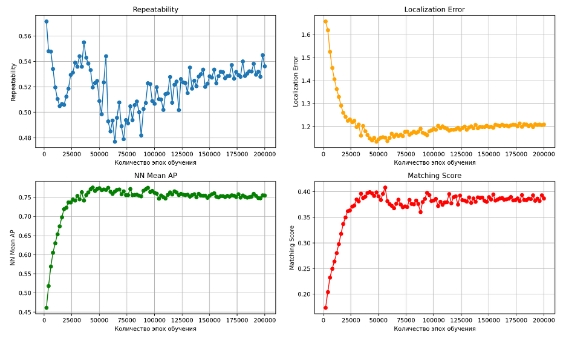

# Обучение модели SuperPoint на изображениях полета беспилотника по пересеченной местности

## Запуск обучения в контейнере Docker

Для запуска Docker-контейнера с поддержкой GPU нужно:

1. Собрать docker-образ. Для этого в текущей директории необходимо выполнить:
```
docker build -t <image_name> .
```

2. Запустить контейнер с поддержкой GPU:
```
docker run --gpus all -it <image_name>
```

3. Выполнить команду `nvidia-smi` внутри контейнера и убедиться что всё установлено корректно

## Обучение модели

Структура папки с датасетом:
```
datasets/ ($DATA_DIR)
|-- drone_flight/
|   |-- images/
|   |   |-- train/
|   |   |   |-- autumn_1470.jpg
|   |   |   `-- ...
|   |   `-- val/
|   |       |-- autumn_1590.jpg
|   |       `-- ...
|   `-- predictions/
|       |-- train/
|       |   |-- autumn_1470.npz
|       |   `-- ...
|       `-- val/
|           |-- autumn_1590.npz
|           `-- ...
|-- HPatches
|   |-- i_ajuntament
|   `-- ...
|
```

Файл с конфигурацией для обучения - [superpoint_drone_train_heatmap.yaml](configs/superpoint_drone_train_heatmap.yaml)

Запуск процесса обучения:
```
python train4.py train_joint configs/superpoint_drone_train_heatmap.yaml superpoint_drone_flight --eval --debug
```

После тренировки логи tensorboard сохранятся в папке runs/, посмотреть их можно командой:
```
tensorboard --logdir=./runs/ [--host | static_ip_address] [--port | 6008]
```

Веса сохранятся в папке logs/superpoint_drone_flight/checkpoints/.

## Оценка дообученной модели

Для оценки весов модели, получавшихся на разных эпохах, было произведено их сравнение на наборе HPatches по метрикам:

- *Repeatability* – доля повторяемых точек относительно общего числа выбранных точек. Находим ключевые точки на исходном изображении и на его гомографической адаптации, а затем получаем совпадающие в пределах 3 пикселей повторяемые точки.
- *Localization Error* – среднее расстояние между предсказанными и истинными позициями ключевых точек.
- *NN Mean AP* – среднее значение AP (Average Precision) по всем ключевым точкам, найденным методом ближайших соседей.
- *Мatching Score* – доля успешно сопоставленных пар относительно общего числа возможных пар.



После анализа результатов оценки и графиков процесса обучения для дальнейшей работы была взята [модель 48000 итерации](logs/superpoint_drone_flight/checkpoints/superPointNet_48000_checkpoint.pth.tar). Её метрики:

- *Repeatability* – 0.524
- *Localization Error* – 0.135
- *NN Mean AP* – 0.772
- *Мatching Score* – 0.399

___

Репозиторий с кодом для формирования датасета и с оценкой дообученной модели по метрике отслеживаемости: [points_extraction](https://github.com/TIoJIuHa/points_extraction)
